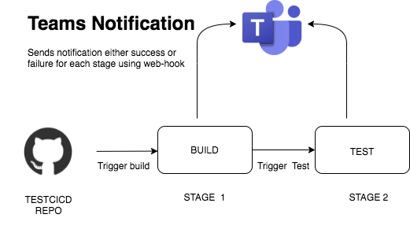

# TESTCICD
# Use Case
1. Lead time: Early feedback and build/test automation help decrease the time it takes to go from code committed to code successfully running in production.

2. Deployment frequency: Automated build and test is a pre-requisite to automated deploy.

3. Time to restore service: Automated pipelines enable fixes to be deployed to production faster reducing Mean Time to Resolution (MTTR)

4. Change failure rate: Early automated testing greatly reduced the number of defects that make their way out to production.
# Techical Approach Towards Solving The Problem
1. Create a sample node test case project (TESTCICD)
2. Connect circle ci with github
3. Create a sample CI/CD pipeline in circleci by writing config.yml on basis of the requirment
4. Create a webhook in MS teams and add configs related webhook in cinfig.yml to trigger when specified condition (progress stage, success and failure) meet.

# Execution 
It triggers whenever we push something to the main branch

# Architecture diagram 

1. Build stage:- It is an optional stage where we can provide some extra requirments before Test stage.
2. Test stage :- In this stage we install the test dependencies and check all the test-cases are pass or not.

Note:- For each stage we provicde Teams notification so we can get the progress report (success/failure) of each stage.
# Demo
[YOUTUBE](https://www.youtube.com/watch?v=4oY88EBLxww)
# Dependencies
1. MOCHA for creating sample testcase
2. CIRCE CI for creating pipeline
3. bluemarblepayroll/status_to_ms_teams_pure_bash@1.0.1 for sending notification.

# How to run 
1. Install dependencies :- `npm install`
2. Run test :- `npm test`

